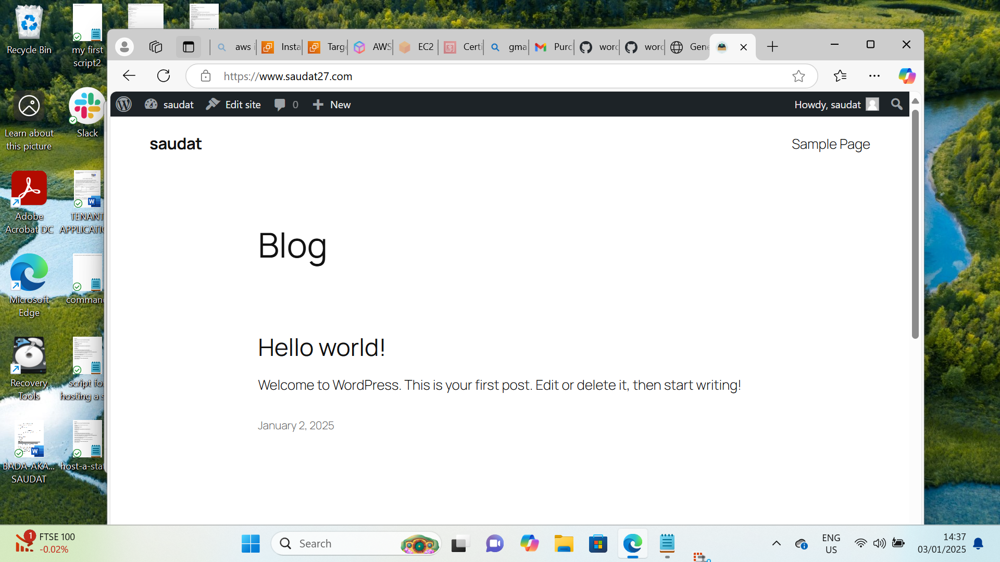

2.


# Hosting a WordPress Website on AWS

This project demonstrates hosting a WordPress website on AWS, leveraging a variety of AWS services to ensure high availability, scalability, and fault tolerance.

## Architecture Overview

The deployment utilizes the following AWS services and configurations:
1. **Virtual Private Cloud (VPC):** Configured with public and private subnets across two availability zones.
2. **Internet Gateway:** Ensures connectivity between VPC instances and the Internet.
3. **Security Groups:** Acts as a network firewall mechanism.
4. **Availability Zones:** Resources are distributed across two zones for enhanced reliability and fault tolerance.
5. **Public Subnets:** Hosts infrastructure components like the NAT Gateway and Application Load Balancer.
6. **Private Subnets:** Ensures secure hosting of web servers (EC2 instances).
7. **NAT Gateway:** Enables instances in private subnets to access the Internet.
8. **EC2 Instances:** Hosts the WordPress application.
9. **Application Load Balancer (ALB):** Distributes traffic to an Auto Scaling Group.
10. **Auto Scaling Group (ASG):** Manages EC2 instances for scalability and fault tolerance.
11. **Elastic File System (EFS):** Provides a shared file system.
12. **Relational Database Service (RDS):** Hosts the WordPress database.
13. **AWS Certificate Manager:** Secures application communication with SSL/TLS.
14. **Simple Notification Service (SNS):** Sends notifications for ASG activities.
15. **Route 53:** Manages domain name and DNS records.


#### Installation Script
```bash
# Switch to root user
sudo su

# Update software packages
sudo yum update -y

# Install Apache and PHP
sudo yum install -y httpd
sudo systemctl enable httpd
sudo systemctl start httpd
sudo dnf install -y php php-cli php-cgi php-curl php-mbstring php-gd php-mysqlnd php-gettext php-json php-xml php-fpm php-intl php-zip php-bcmath php-ctype php-fileinfo php-openssl php-pdo php-tokenizer

# Install MySQL
sudo wget https://dev.mysql.com/get/mysql80-community-release-el9-1.noarch.rpm
sudo dnf install -y mysql80-community-release-el9-1.noarch.rpm
sudo rpm --import https://repo.mysql.com/RPM-GPG-KEY-mysql-2023
sudo dnf install -y mysql-community-server
sudo systemctl start mysqld
sudo systemctl enable mysqld

# Mount EFS
EFS_DNS_NAME=fs-0f178f50adf194201.efs.eu-west-2.amazonaws.com
sudo mkdir -p /var/www/html
sudo mount -t nfs4 -o nfsvers=4.1,rsize=1048576,wsize=1048576,hard,timeo=600,retrans=2,noresvport "$EFS_DNS_NAME":/ /var/www/html

# Download and configure WordPress
wget https://wordpress.org/latest.tar.gz
tar -xzf latest.tar.gz
sudo cp -r wordpress/* /var/www/html/
sudo cp /var/www/html/wp-config-sample.php /var/www/html/wp-config.php
sudo chown -R apache:apache /var/www/html
sudo chmod -R 775 /var/www/html
sudo service httpd restart
```

## Key Features

- **High Availability:** Resources are distributed across multiple availability zones.
- **Scalability:** Auto Scaling Group adjusts the number of EC2 instances based on demand.
- **Security:** Private subnets, security groups, and SSL/TLS ensure robust security.
- **Fault Tolerance:** Automatic failover capabilities with multiple availability zones.

## Additional Resources

- **Scripts:** Deployment and installation scripts are provided in the repository.
- **Architecture Diagram:** Visual representation of the infrastructure setup.

## Contact

For inquiries or issues, please contact [saudat] at [akandesaudat2711@gmail.com].
